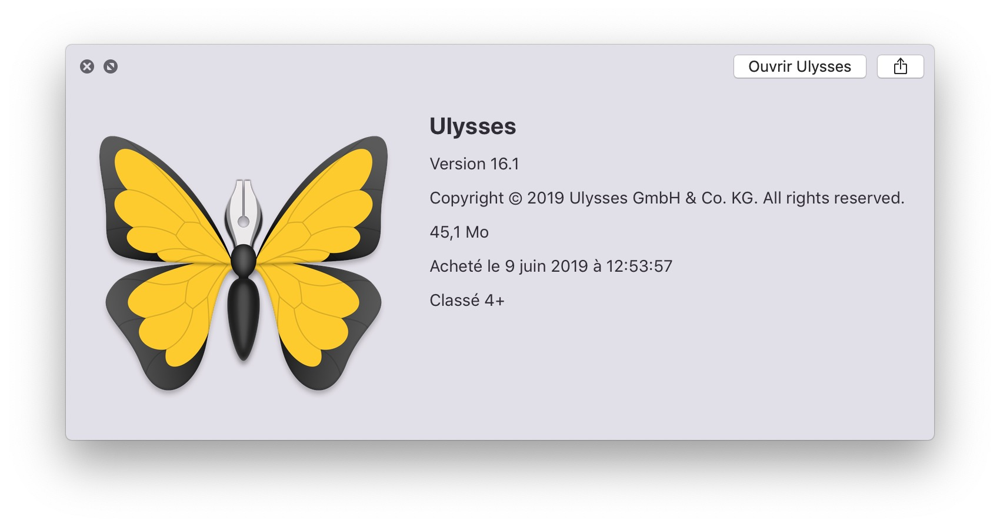

# IconBackground

Writing about apps? IconBackground allow you to create hero images from the icon in two seconds. IconBackground extracts the icon from a macOS app, or takes any icon from the Finder, and puts it on a beautiful colour-matched background.

## Example

IconBackground can take a macOS app:

And make this image:

It can also take any icon, in this case an iOS app icon:

And make this image:

The colour of the background is the dominant colour of the central part of the original icon. IconBackground might produce different results on different occasions, as the position of the central part is slightly shifted from launch to launch.

To preserve the aspect ratio of the hero image, the size of the output is tied to the size of the original icon. When using really small icons, the output will be limited to 500 × 312px. The output will be 1,000 × 625px when using 512px icons, and 2,000 × 1,250px when using 1,024px icons. Bigger icons are not (yet) supported.

## Usage

To extract the icon from a macOS app:

	python3 icon-background.py -a <path_of_the_app>
	
To use any icon stored on disk:

	python3 icon-background.py -i <path_of_the_icon>
	
For best results, use icons that sit on a transparent background (.ICNS or .PNG files).
	
## Requirements

- argparse
- biplist
- collections
- pillow
- random
- sklearn

## Licence

EUPL 1.2.